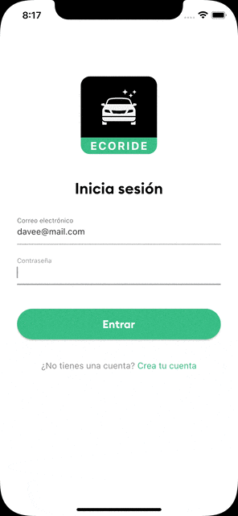

<div align="center">
  <h1>ECORIDE</h1>


  <p>Application to practice with maps and routes, simulating that it is for people who have a car and would like to take other people who are going to the same destination and only have to cooperate with a small amount.</p>
</div>

### Preview

This image is a screenshot of my emulator that doesn't work very well.

<div align="center">



</div>

## Features

- Use of google maps
- Geocoding integration
- Firebase for authentication
- Address autocomplete
- Custom bookmarks

## Important

This application only uses the google map, the routes, polylines and the autocomplete are from third parties. To have a better result, it is best to use the libraries offered by the google suite that work very well together.

## Installation

To clone and run this application, you'll need [Git](https://git-scm.com) and
[Flutter](https://docs.flutter.dev/get-started/install) installed on your computer. 

From your command line:

```bash
# Clone this repository
$ git clone https://github.com/DavidBarcenas/flutter-eco-ride.git

# Go into the repository
$ cd flutter-eco-ride

# Install dependencies
$ flutter pub get

# Run the app in the way your IDE describes
```

## Note
 
Don't forget to add your environment variables for firebase and google maps. Look for the file **env.example** in the root of the project.

## License

Released under the [MIT licensed](LICENSE).\
Feel free to fork this project and improve it. Give a ⭐️ if you like this project!
